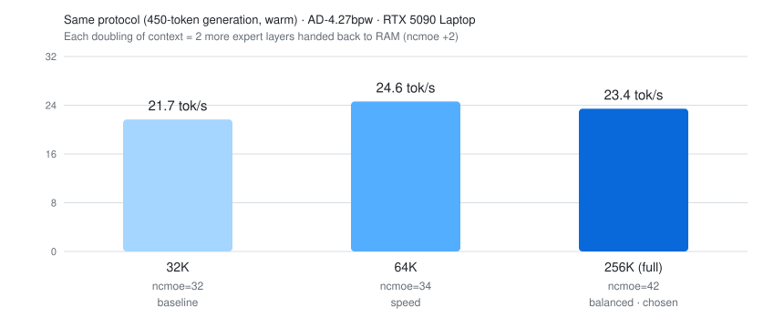
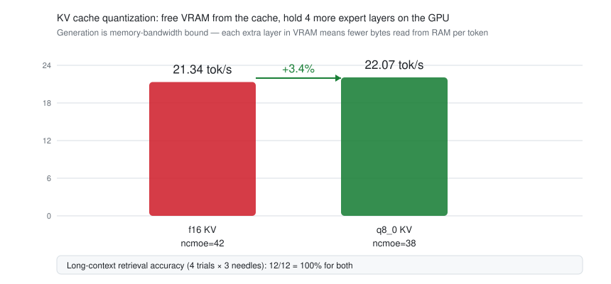
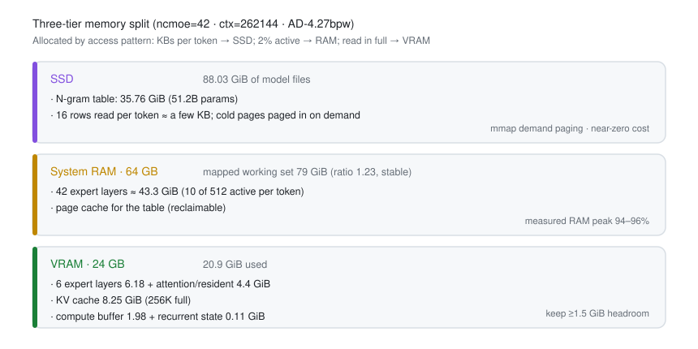
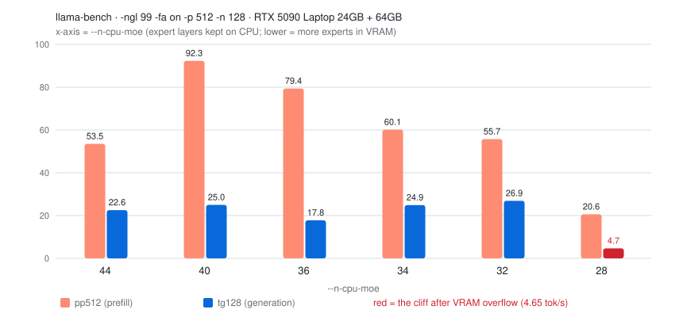

# Qwen3.8-Flash-Next 177B on an RTX 5090 Laptop — 24 GB VRAM + 64 GB RAM · 256K Context

**English** | [中文首页 →](./README.md)


Running **Qwen3.8-Flash-Next 177B** (GGUF quantized) on a single **RTX 5090 Laptop (24 GB VRAM) + 64 GB RAM** — reaching the **full 256K context at 23–28 tok/s**, with the complete story of quant selection, pitfalls, and tuning.

**Chosen quant**：⭐ **`AtomicChat AD-4.27bpw-Q4_K_M-M64`** (88.03 GiB, table in its own shard)

> 📄 **Full write-up** → [English](./docs/deploy-log.en.md) ｜ [中文](./docs/deploy-log.zh.md)
> 📊 **Models & quants** → [reference](./docs/model-reference.md)
> 🔧 **Port to your hardware** → [porting guide](./docs/porting-guide.md)
> 🧪 **Raw measurements** → [results/](./results/README.md)
> 🛠 **Reusable bench tool** → [tools/](./tools/bench_single_instance.py)

---

## Results at a glance

| Metric | Final |
|---|---|
| Generation | **22.1–25.3 tok/s** (256K full length; multi-round median 22.07, long-answer mean 25.34) |
| Context | **256K = 262,144 tokens** (full model length) |
| Quant | AD-4.27bpw (primary) / AD-3.84bpw (speed option) |
| **KV cache** | **q8_0** (8.25 GiB → ~4.13 GiB; the freed VRAM holds 4 more expert layers → **+3.4–5%**) |
| VRAM used | ~20.9 of 24 GiB |
| RAM peak (single instance) | 82–96% |



### Another 3–5%: freeing VRAM from the KV cache

The KV cache does no compute but occupies VRAM. Quantizing it frees room for more expert layers on the GPU, so each token reads fewer bytes from RAM — and generation is exactly where memory bandwidth binds.



| Config | ncmoe | Generation (multi-round median) | Long-context retrieval |
|---|---|---|---|
| f16 KV (baseline) | 42 | 21.34 tok/s | 12/12 = 100% |
| **q8_0 KV** ⭐ | **38** | **22.07 (+3.4%)** | **12/12 = 100%** |
| q4_0 KV | 36 | 25.03 (long-answer mean, not faster) | 12/12 = 100% |

> Accuracy validated with a **multi-trial randomized needle test**: a 9.7k-token document, 3 facts at random depths, identical seeds across configs, and `finish_reason` checks to rule out truncation artifacts (see [results/needle-accuracy.txt](./results/needle-accuracy.txt)).

## Three-tier memory split

The core idea: **allocate by access pattern** instead of pushing everything into VRAM.



## Quant selection

**The decisive filter is not bit-width but shard layout** — whether the N-gram table (35.76 GiB) gets its own shard:

| Variant | Size | Shard layout | Measured here | Verdict |
|---|---|---:|---|---|
| ⭐ **AtomicChat AD-4.27bpw-Q4_K_M-M64** | 88.03 GiB / 33 shards | ✅ table in its own shard | **21.7 (32K) / 24.6–28.2 (64K) / 23.4 tok/s (256K)** | ✅ **Chosen · primary** |
| AtomicChat AD-3.84bpw-IQ4_XS-M64 | 79.10 GiB / 28 shards | ✅ table in its own shard | **+5–9.5%** at equal settings (64K warm: 28.24 tok/s) | ⚠️ Speed alternative (body ≈2.92 bpw, no quality data) |
| AtomicChat AD-5.00bpw-Q5_K_M-M64 | 102.93 GiB / 33 shards | ✅ own shard (table 50.66 GiB) | not tested | ⚠️ Not chosen: bigger table, more SSD pressure |
| unsloth UD-IQ4_XS | 87.25 GiB / 3 shards | ❌ table mixed with experts | not tested | ❌ **Layout unusable**: whole shard pinned in RAM, up to 89.6 GiB resident > 64 GiB |
| unsloth UD-Q3_K_XL | 83.80 GiB / 3 shards | ❌ mixed (inferred) | not tested | ❌ Same problem |
| NVFP4 (Blackwell native) | — | — | — | ❌ **No such quant for this model** (164 files enumerated across both repos, zero hits) |

> [!TIP]
> **Final choice: AtomicChat AD-4.27bpw-Q4_K_M-M64**
> Among the only viable layout ("table in its own shard"), it is the sole candidate with ① published quality data (**KLD 0.0842 / Top-1 89.49%**) and ② a body at **3.57 bpw** — the sweet spot between speed and quality.

## Final config

```bash
llama-server \
  -m Qwen3.8-Flash-Next-AD-4.27bpw-Q4_K_M-M64-00001-of-00033.gguf \
  -ngl 99 --n-cpu-moe 38 \
  -fa on -fit off \
  -c 262144 -np 1 \
  -ctk q8_0 -ctv q8_0 \
  --jinja
```

| Need | ncmoe | ctx | KV | Measured |
|---|---:|---:|---|---|
| Speed-first | 32 | 65,536 | f16 | 24.6–28.2 tok/s |
| **Balanced (recommended)** | **38** | **262,144** | **q8_0** | **22.1–25.3 tok/s** |
| Most conservative | 42 | 262,144 | f16 | 21.3 tok/s |
| Multi-slot | 44 | 262,144 | q8_0 | more VRAM headroom for `-np` |



<sub>`--n-cpu-moe` is the only knob, and it has a cliff: at 28 layers VRAM overflows and generation drops from 26.9 to 4.7 tok/s.</sub>

> **The see-saw rule:** moving 2 expert layers back to RAM frees ≈2.06 GiB of VRAM ≈ doubles the context window.

## Serving & usage

```bash
# 1) Launch (model loads in ~40-70 s; 88 GiB of weights stream into page cache)
llama-server -m <first-shard>.gguf -ngl 99 --n-cpu-moe 38 -fa on -fit off \
  -c 262144 -np 1 -ctk q8_0 -ctv q8_0 --jinja --host 127.0.0.1 --port 8080

# 2) Open http://127.0.0.1:8080 in a browser (built-in web UI),
#    or point any OpenAI-compatible client at http://127.0.0.1:8080/v1
#    API key and model name can be anything (no auth locally): sk-local / qwen3.8-flash-next

# 3) Or call it from the command line
curl http://127.0.0.1:8080/v1/chat/completions -H "Content-Type: application/json" \
  -d '{"messages":[{"role":"user","content":"hello"}],"max_tokens":200}'
```

Clients that work well: **Cherry Studio**, **Chatbox**, **Open WebUI** (chat); **Continue** / **Cline** (VS Code coding). Add `--mmproj` for vision (≈0.85 GiB extra VRAM).

| What you'll see | Normal value |
|---|---|
| Startup time | 40–70 s |
| First responses | 17–19 tok/s (warm-up — slower is expected) |
| Sustained chat | **22–25 tok/s** |
| System RAM usage | 90–96% (working set exceeding physical RAM is by design, not a fault) |
| Long-document prefill | ~110 tok/s → ~90 s per 10k tokens; filling 256K takes ~40 min in theory |

**Three rules:** ① **one instance only** — a second instance always overflows RAM and drops throughput to single digits; ② stop it when done (idle residency costs 22 GB of VRAM); ③ restart the process after any config change (arguments are read once at startup).

## Repository layout

```
├── README.md / README.en.md      ← 中文 / English homepages
├── assets/                       ← charts (SVG, zh + en)
├── docs/
│   ├── deploy-log.zh.md          ← 完整实录（中文，11 sections）
│   ├── deploy-log.en.md          ← Full write-up (English, 11 sections)
│   ├── model-reference.md        ← Architecture, quants, engine, NVFP4 rationale
│   └── porting-guide.md          ← Formulas + hardware lookup table
├── results/                      ← raw measurement outputs
│   ├── llama-bench-ncmoe-sweep.txt
│   ├── single-instance-matrix.txt
│   ├── long-context-and-384.txt
│   ├── mtp-draft-acceptance.txt
│   ├── vram-ledger-8192.txt
│   ├── oom-evidence-ncmoe40-ctx256k.txt
│   ├── kv-quant-ab.txt           ← KV quantization A/B (+3.4%)
│   ├── needle-accuracy.txt       ← long-context retrieval (12/12)
│   └── engine-build-ab.txt       ← engine build A/B (no gain)
├── tools/
│   ├── bench_single_instance.py  ← ncmoe sweep driver (single-instance discipline)
│   ├── ab_bench.py               ← multi-round server benchmark (median-of-N)
│   └── needle_test.py            ← long-context retrieval accuracy test
└── LICENSE
```

## FAQ

**Q: Why not NVFP4? The RTX 5090 is Blackwell.**
A: Three reasons: ① **no NVFP4 quant exists** for this model (full enumeration of both publishers: 164 files, zero FP4 hits); ② generation is **memory-bandwidth bound**, not compute bound — FP4 tensor cores accelerate matmul, not the per-token expert weight reads; ③ NVFP4 is ≈**4.5 bpw** effective, *larger* than the 3.57 bpw body we run — on a machine where the model exceeds total memory that means reading ~26% more bytes per token. See [model-reference §2.4](./docs/model-reference.md).

**Q: Why llama.cpp and not vLLM / TensorRT-LLM?**
A: Only llama.cpp offers `--n-cpu-moe` (per-layer control of which experts stay in RAM) plus mmap demand paging — the two prerequisites for running an 88 GiB model on 24 GB VRAM. See [model-reference §2.5](./docs/model-reference.md).

**Q: Does KV quantization (`-ctk/-ctv q8_0`) hurt quality?**
A: **No measurable loss here.** Nine-needle randomized test across a 9.7k-token document: f16 and q8_0 both scored **12/12** ([raw data](./results/needle-accuracy.txt)). And the 4 GiB it frees buys 4 more expert layers — worth **+3.4–5%** generation. q4_0 also passed accuracy but was **not faster**, so it isn't worth the extra risk.

**Q: Will a newer llama.cpp build be faster?**
A: **No.** Builds b10840 and b10889 were statistically indistinguishable in llama-bench (r=3 and r=5) and at the production config (6-round medians: 21.34 vs 20.86 tok/s) — [raw data](./results/engine-build-ab.txt). Generation here is **memory-bandwidth bound**; engine upgrades optimize the **compute** path. The counterexample is a small model with NVFP4 fully resident in VRAM — compute-bound, where kernel upgrades do pay off.

**Q: How large a context can I run? What about on a 24 GB card like yours?**
A: Use the formula in the [porting guide](./docs/porting-guide.md): `VRAM ≈ 4.4 + (48−ncmoe)×1.03 + ctx×33KiB + compute buffer`.

| Context | ncmoe | KV | Measured generation |
|---|---:|---|---|
| 32K | 32 | f16 | 21.7 tok/s |
| 64K | 34 | f16 | 24.6–28.2 tok/s |
| **256K (full)** | **38** | **q8_0** | **22.1–25.3 tok/s** |
| 256K (full, no KV quant) | 42 | f16 | 21.3 tok/s |

**A 24 GB card can still reach the full 256K** — each doubling of context costs 2 more expert layers handed back to RAM (a small speed drop, still above 23 tok/s).
On a **32 GB card** (e.g. desktop 5090), the formula suggests ncmoe 34–36 with 256K at an **estimated** 26–30 tok/s (not measured).

**Q: Can generation go faster?**
A: Two levers: ① a smaller body quant (AD-3.84bpw, measured +5–9.5%); ② more VRAM so more expert layers fit (≈+1–3% per 2 layers). MTP speculative decoding is a **net loss** in this "experts live in RAM" configuration — leave it off.

**Q: Will it blow up my RAM?**
A: Single instance peaks at 82–96%, stable. The real risk is running **multiple llama-server instances** — each demands 13–16 GiB of VRAM and two will always overflow.

## Who this is for

- You have a **24 GB VRAM consumer GPU + 64 GB RAM** and want to run 100B+ MoE models locally;
- You're choosing between quant variants and want **measured** numbers, not guesses;
- You want the maximum usable **context length** and the `--n-cpu-moe` tuning recipe;
- You want to detect **silent failures** (CPU fallback, VRAM oversubscription) instead of wondering why it's slow.

## Tested on

| Item | Spec |
|---|---|
| GPU | RTX 5090 **Laptop** GPU, 24 GB VRAM (24435 MiB reported), compute capability **12.0 (sm_120)** |
| RAM | 64 GB |
| Storage | NVMe SSD (model: 88.03 GiB ≈ 94.5 GB) |
| Engine | llama.cpp (Unsloth `b10840-mix-d5c17a0`, `cuda12-portable` build) + manually added CUDA 12.8 runtime DLLs. Build b10889 also tested — no throughput gain (see [results/engine-build-ab.txt](./results/engine-build-ab.txt)) |
| Model | Qwen3.8-Flash-Next GGUF, 176.9B total params (incl. a 51.2B N-gram table) |

## Key takeaways

1. **Layout beats bit-width.** Whether the 35.76 GiB N-gram table gets its own shard decides if the approach is viable on this machine;
2. **Guard against two silent failures** — a missing CUDA runtime silently falls back to CPU; VRAM overflow silently spills over PCIe (30× slower, no error);
3. **MoE + CPU-resident experts = speculative decoding is a net loss** — verification batches read the union of activated experts, amplifying memory traffic;
4. **The KV cache is surprisingly small** (only 33 KiB per token) → give VRAM to context; and it can be **quantized** too, trading cache precision for more expert layers on the GPU — a free speedup;
5. **`--n-cpu-moe` is the one knob**, and it has a cliff (28 layers collapses in this case);
6. **Engine upgrades don't help** — generation is bandwidth-bound; newer kernels optimize compute (measured: no gain);
7. **Benchmark with median-of-N** — the first responses after startup are consistently slower; single-shot numbers mislead.

## Disclaimer

- All numbers are **measured on one machine**; results vary with driver and build versions;
- Model weights belong to their respective publishers;
- The benchmark script **kills `llama-server` processes**; do not run it while other inference services are active.

## License

MIT (applies to this repository's docs and scripts only)
