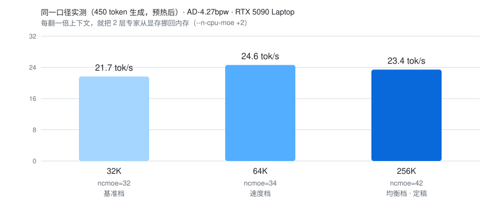
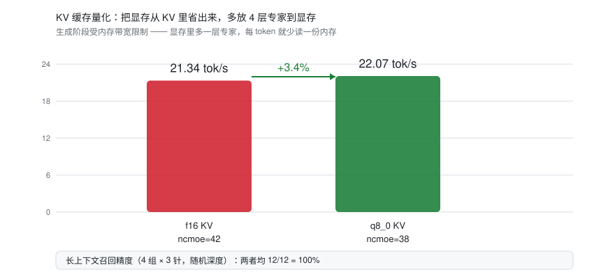
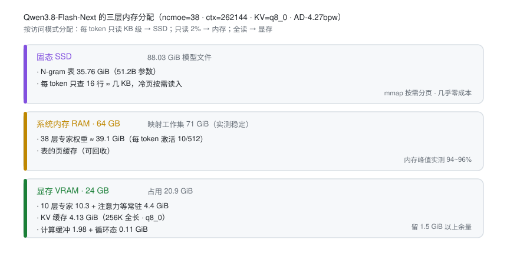
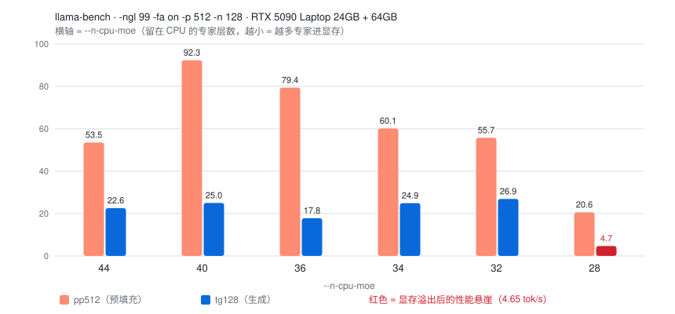

# Qwen3.8-Flash-Next 177B on an RTX 5090 Laptop — 24 GB VRAM + 64 GB RAM · 256K Context

**中文** ｜ [English homepage →](./README.en.md)


**中文**：一台 RTX 5090 笔记本（24G 显存）+ 64G 内存，跑通 Qwen3.8-Flash-Next 177B 的 GGUF 量化版：**256K 上下文、23–28 tok/s**，以及完整的选型、踩坑与调优记录。
**English**: Running **Qwen3.8-Flash-Next 177B** (GGUF quantized) on a single **RTX 5090 Laptop (24 GB VRAM) + 64 GB RAM** — **256K context at 23–28 tok/s**, with the full story of quant selection, pitfalls, and tuning.

**选定量化 / Chosen quant**：⭐ **`AtomicChat AD-4.27bpw-Q4_K_M-M64`**（88.03 GiB，表独占分片）

> 📄 **完整实录** → [中文](./docs/deploy-log.zh.md) ｜ [English](./docs/deploy-log.en.md)
> 📊 **模型与量化参考** → [models & quants](./docs/model-reference.md)
> 🔧 **移植到其他硬件** → [porting guide](./docs/porting-guide.md)
> 🧪 **原始实测数据** → [results/](./results/README.md)
> 🛠 **可复用测试工具** → [tools/](./tools/bench_single_instance.py)

---

## 成果一览 / Results at a glance

| 指标 / Metric | 最终 / Final |
|---|---|
| 生成速度 Generation | **22.1~25.3 tok/s**（256K 全长；多轮中位数 22.07，长答均值 25.34） |
| 上下文 Context | **256K = 262,144 tokens**（模型全长 / full length） |
| 量化 Quant | AD-4.27bpw（主力）/ AD-3.84bpw（速度备选） |
| **KV 缓存** | **q8_0**（从 8.25 GiB 降到 ~4.13 GiB，省下的显存多放 4 层专家 → **+3.4~5%**） |
| 显存占用 VRAM | ~20.9 / 24 GiB |
| 单实例内存峰值 RAM peak | 82–96% |



### 还能再挖 3~5%：把 KV 从显存里省出来

KV 缓存不参与计算却占着显存。量化它 → 省下的显存换更多专家层进显存 → 每 token 少读一份内存（生成阶段正是受内存带宽限制）。



| 配置 | ncmoe | 生成速度（多轮中位数） | 长上下文召回精度 |
|---|---|---|---|
| f16 KV（基线） | 42 | 21.34 tok/s | 12/12 = 100% |
| **q8_0 KV** ⭐ | **38** | **22.07（+3.4%）** | **12/12 = 100%** |
| q4_0 KV | 36 | 25.03（长答均值，未更快） | 12/12 = 100% |

> 精度用**多轮随机化「大海捞针」**验证：9.7k token 文档、3 个事实埋在不同随机深度、同种子跨配置对比、检查 `finish_reason` 排除截断假象（见 [results/needle-accuracy.txt](./results/needle-accuracy.txt)）。

## 三层内存分配 / Three-tier split

整套方案的核心：**按访问模式分配存储**，而不是一味往显存塞。



## 量化选型结果 / Quant selection

**决定性筛除条件不是位宽，而是分片布局**——N-gram 表（35.76 GiB）是否独占分片：

| 量化版本 | 大小 | 分片布局 | 本机实测 | 判定 |
|---|---|---:|---|---|
| ⭐ **AtomicChat AD-4.27bpw-Q4_K_M-M64** | 88.03 GiB / 33 片 | ✅ 表独占分片 | **21.7（32K）/ 24.6–28.2（64K）/ 23.4 tok/s（256K）** | ✅ **选定 · 主力** |
| AtomicChat AD-3.84bpw-IQ4_XS-M64 | 79.10 GiB / 28 片 | ✅ 表独占分片 | 同档 **+5~9.5%**（64K 热态 28.24 tok/s） | ⚠️ 速度备选（主体 ≈2.92bpw，质量无数据） |
| AtomicChat AD-5.00bpw-Q5_K_M-M64 | 102.93 GiB / 33 片 | ✅ 表独占分片（表 50.66 GiB） | 未测 | ⚠️ 未选：表更大，SSD 读压力上升 |
| unsloth UD-IQ4_XS | 87.25 GiB / 3 片 | ❌ 表与专家混装 | 未测 | ❌ **布局不可用**：整片被锁进内存，最坏 89.6 GiB 常驻 > 64 GiB |
| unsloth UD-Q3_K_XL | 83.80 GiB / 3 片 | ❌ 混装（推定） | 未测 | ❌ 同上 |
| NVFP4（Blackwell 原生格式） | — | — | — | ❌ **该模型无此版本**（两仓库共 164 个文件枚举，零命中） |

> [!TIP]
> **最终选择：AtomicChat AD-4.27bpw-Q4_K_M-M64**
> 在"表独占分片"这一唯一可行布局里，只有它同时满足：① 有公开质量数据（**KLD 0.0842 / Top-1 89.49%**）；② 主体 **3.57 bpw** 位于"速度 vs 质量"的平衡点。

## 最终配置 / Final config

```bash
llama-server \
  -m Qwen3.8-Flash-Next-AD-4.27bpw-Q4_K_M-M64-00001-of-00033.gguf \
  -ngl 99 --n-cpu-moe 38 \
  -fa on -fit off \
  -c 262144 -np 1 \
  -ctk q8_0 -ctv q8_0 \
  --jinja
```

| 需求 Need | ncmoe | ctx | KV | 实测 Measured |
|---|---:|---:|---|---|
| 极速 Speed-first | 32 | 65,536 | f16 | 24.6–28.2 tok/s |
| **均衡 Balanced（推荐）** | **38** | **262,144** | **q8_0** | **22.1~25.3 tok/s** |
| 精度最保守 Conservative | 42 | 262,144 | f16 | 21.3 tok/s |
| 多会话 Multi-slot | 44 | 262,144 | q8_0 | 显存余量更大，可开 `-np` 多槽 |



<sub>`--n-cpu-moe` 是本方案唯一的旋钮，且存在悬崖：28 层时显存溢出，生成速度从 26.9 掉到 4.7 tok/s。</sub>

> 跷跷板规律 / The see-saw rule：**每 +2 层专家回内存 ≈ 腾出 2.06 GiB 显存 ≈ 上下文翻一倍**

## 使用 / Serving & usage

```bash
# 1) 启动（模型加载约 40~70 秒；88 GiB 权重要从 SSD 读入页缓存）
llama-server -m <首分片>.gguf -ngl 99 --n-cpu-moe 38 -fa on -fit off \
  -c 262144 -np 1 -ctk q8_0 -ctv q8_0 --jinja --host 127.0.0.1 --port 8080

# 2) 浏览器打开 http://127.0.0.1:8080 直接用（自带网页界面）
#    或接任意 OpenAI 兼容客户端：Base URL = http://127.0.0.1:8080/v1
#    API Key 与模型名随意填（本地服务不校验），如 sk-local / qwen3.8-flash-next

# 3) 命令行调用
curl http://127.0.0.1:8080/v1/chat/completions -H "Content-Type: application/json" \
  -d '{"messages":[{"role":"user","content":"你好"}],"max_tokens":200}'
```

客户端举例：**Cherry Studio**、**Chatbox**、**Open WebUI**（日常对话）；**Continue** / **Cline**（VS Code 写代码）。需要识图时挂 `--mmproj`（多占约 0.85 GiB 显存）。

| 日常现象 | 正常值 |
|---|---|
| 启动耗时 | 40~70 秒 |
| 首轮速度 | 17~19 tok/s（预热期，正常偏慢） |
| 连续对话 | **22~25 tok/s** |
| 系统内存占用 | 90~96%（映射工作集大于物理内存是设计前提，不是故障） |
| 长文预填充 | ~110 tok/s → 1 万 token 约 90 秒；填满 256K 理论约 40 分钟 |

**三条纪律**：① **只开一个实例**——多开必爆内存，速度跌到个位数；② 用完就关（常驻占 22 GB 显存）；③ 改配置后必须重启进程（参数只在启动时读取）。

## 目录 / Repository layout

```
├── README.md                     ← 本页 / this page
├── README.en.md                  ← English homepage
├── assets/                       ← 图表 / charts (SVG)
├── docs/
│   ├── deploy-log.zh.md          ← 完整实录（中文，十一节）
│   ├── deploy-log.en.md          ← Full write-up (English)
│   ├── model-reference.md        ← 架构参数、量化对照、引擎与运行时、NVFP4 说明
│   └── porting-guide.md          ← 移植公式与硬件对照表
├── results/                      ← 原始实测输出
│   ├── llama-bench-ncmoe-sweep.txt
│   ├── single-instance-matrix.txt
│   ├── long-context-and-384.txt
│   ├── mtp-draft-acceptance.txt
│   ├── vram-ledger-8192.txt
│   ├── oom-evidence-ncmoe40-ctx256k.txt
│   ├── kv-quant-ab.txt           ← KV 量化 A/B（+3.4%）
│   ├── needle-accuracy.txt       ← 长上下文召回精度（12/12）
│   └── engine-build-ab.txt       ← 引擎构建 A/B（无提升）
├── tools/
│   ├── bench_single_instance.py  ← ncmoe 扫描驱动（单实例纪律）
│   ├── ab_bench.py               ← 多轮取中位数的服务端基准
│   └── needle_test.py            ← 长上下文召回精度测试
└── LICENSE
```

## 常见问题 / FAQ

**Q: 为什么不用 NVFP4？Blackwell 不是原生支持吗？**
A: 三个层次：① **这个模型没有 NVFP4 版本**（两个发布方共 164 个文件全量枚举，无 FP4 量化）；② 生成的瓶颈是**内存带宽**不是算力——4 位浮点张量核加速的是矩阵乘法，帮不到"每 token 从内存读专家权重"；③ NVFP4 等效约 **4.5 bpw**，比现用的 3.57 bpw 主体**更大**，在内存受限场景反而更慢。详见 [model-reference §2.4](./docs/model-reference.md)。

**Q: 为什么用 llama.cpp，不用 vLLM / TensorRT-LLM？**
A: 只有 llama.cpp 提供 `--n-cpu-moe` 这种**按层把专家留在内存**的精细控制，以及 mmap 分片按需分页——这两点是 24G 显存跑 88 GiB 模型的前提。详见 [model-reference §2.5](./docs/model-reference.md)。

**Q: 上下文最多能开多大？我这台 24G 显存的机器能开多少？**
A: 用 [移植指南](./docs/porting-guide.md) 的公式自己算：`VRAM ≈ 4.4 + (48−ncmoe)×1.03 + ctx×33KiB + 计算缓冲`。

| 上下文 Context | ncmoe | 实测生成 Measured |
|---|---:|---|
| 32K | 32 | 21.7 tok/s |
| 64K | 34 | 24.6~28.2 tok/s |
| **256K（模型全长）** | **42** | **23.4 tok/s** |

**24G 显存也能把 256K 开满**，代价是每多要一倍上下文，就要多还 2 层专家到内存（速度略降，仍在 23 tok/s 以上）。
若你是 **32G 显存**（如台式 5090），按公式可停在 ncmoe 34~36 + 256K，速度**推算** 26~30 tok/s（未实测）。

**Q: KV 量化（`-ctk/-ctv q8_0`）会不会掉精度？**
A: 本机实测**无损失**：9.7k token 文档、随机深度埋 3 个事实、4 组测试，f16 与 q8_0 均为 **12/12 满分**（[原始数据](./results/needle-accuracy.txt)）。而且省下的 4 GiB 显存能多放 4 层专家，直接换来 **+3.4~5%** 速度 —— 这是目前性价比最高的一档优化。q4_0 精度也过关但**速度并未更快**，故不推荐。

**Q: 换个更新的 llama.cpp 构建会不会更快？**
A: 实测**没有提升**。b10840 与 b10889 在 llama-bench（r=3 / r=5）和生产配置服务端（6 轮取中位数：21.34 vs 20.86 tok/s）上都统计不可区分（[原始数据](./results/engine-build-ab.txt)）。原因：生成阶段受**内存带宽**限制，引擎升级优化的是**计算路径**。反例是"小模型 + NVFP4 + 权重全在显存"——那是算力受限，内核升级才有效。

**Q: 生成速度还能再快吗？**
A: 目前只剩三条路：① 更小的主体量化（AD-3.84bpw，实测 +5~9.5%，但质量无公开背书）；② 更多显存放专家（本机已接近上限，KV 量化已把可挖的挖完）；③ 更快的内存（本机 4 条 16GB 受双 DIMM/通道限制跑在 5200 MT/s，换 2×32GB 可跑满 5600，带宽 +7.7%）。MTP 投机解码是**负收益**，换新引擎**无收益**，两条都已实测排除。

**Q: 会不会把内存撑爆？**
A: 单实例下实测内存峰值 82~96%，稳定运行。**真正的风险是同时开多个 llama-server 实例**——每个要 13~16 GiB 显存，两个必爆。

## 适用场景 / Who this is for

- 你有一台 **24 GB 显存的消费级显卡 + 64 GB 内存** 的机器，想跑 100B+ 级别的 MoE 大模型；
- 你在纠结**选哪个量化档位**（AD 4.27 / 3.84 / 5.00，unsloth UD-Q3_K_XL / UD-IQ4_XS）；
- 你想知道**上下文能开多大**、`--n-cpu-moe` 怎么调、MTP 投机解码为什么在你这儿没用；
- 你想避免**静默失败**：推理悄悄退回 CPU、显存悄悄溢出到内存。

- You have a **24 GB VRAM consumer GPU + 64 GB RAM** and want to run 100B+ MoE models locally;
- You're choosing between quant variants and want **measured** numbers, not guesses;
- You want the maximum usable **context length**, and the `--n-cpu-moe` tuning recipe;
- You want to detect **silent failures** (CPU fallback, VRAM oversubscription) instead of guessing why it's slow.

## 硬件与软件 / Tested on

| 项目 Item | 规格 Spec |
|---|---|
| GPU | RTX 5090 **Laptop** GPU，24 GB 显存（24435 MiB 可见），compute capability **12.0 (sm_120)** |
| 内存 RAM | 64 GB |
| 存储 Storage | NVMe SSD（模型 88.03 GiB ≈ 94.5 GB） |
| 引擎 Engine | llama.cpp（Unsloth `b10840-mix-d5c17a0`，`cuda12-portable` 构建）+ 补装的 CUDA 12.8 运行时 DLL |
| 模型 Model | Qwen3.8-Flash-Next GGUF，总参数 176.9B（含 51.2B N-gram 表） |

## 关键结论速览 / Key takeaways

1. **布局比位宽重要** — N-gram 表（35.76 GiB）是否独占分片，决定方案能否成立；
2. **两类静默失败**要防 — CUDA 运行时缺失会静默退回 CPU；显存溢出会静默走 PCIe（慢 30 倍、无报错）；
3. **MoE + CPU 专家 = 投机解码负收益** — 验证批的专家激活并集会放大内存流量；
4. **KV 缓存小得出奇**（每 token 仅 33 KiB）→ 显存尽量让给上下文，把专家还给内存；**而且 KV 本身还能量化**，省出的显存换专家层 = 免费提速；
5. **`--n-cpu-moe` 是唯一的旋钮**，且存在悬崖（本例 28 层即崩）；
6. **换引擎不会更快** — 生成受内存带宽限制，内核升级优化的是算力路径（实测无提升）；
7. **测速必须多轮取中位数** — 服务端首轮普遍偏慢，单发测量会得出错误结论。

## 免责声明 / Disclaimer

- 所有数据均为**单机实测**，硬件/驱动/构建版本不同结果会有差异；
- 模型权重与量化文件版权归各自发布方；
- 测试脚本会**自动结束 llama-server 进程**，请勿在有其他推理服务运行时使用。

## License

MIT（仅适用于本仓库的文档与脚本 / applies to this repository's docs and scripts only）
